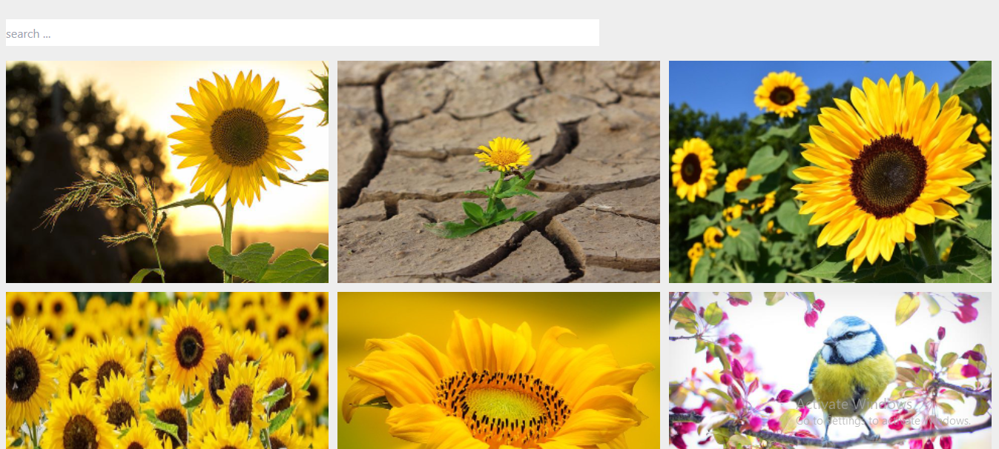

# image-search-engine

Scope

Create a simple/small image search engine connected to the pixabay api in ReactJS with this Mockup ( it’s a mockup, feel free to do your own UX/UI ): 

We will need to be able to search for a color/ flower and you will retrieve data from pixabay and display it 

Some rules

Use at least once await and async functions ( to get data from API ) 
Use UseEffect Hook
Use UseState Hook
Use Javascript ( no typescript )
Use Tailwind

## API

Documentation : https://pixabay.com/api/docs/

Example : 
https://pixabay.com/api/?key=17555297-46a99d3dc7abf78679ec9e640&q=yellow+flowers&image_type=photo&pretty=true

### Homepage

## Getting started :
This project was bootstrapped with [Create React App](https://github.com/facebook/create-react-app) and Redux Library.

to get a local copy in your machine :

- clone the repository running `git clone <ur>` in your terminal.
- run `npm install` on the root folder of the project.

## Available Scripts

In the project directory, you can run:

### `npm start`

Runs the app in the development mode.\
Open [http://localhost:3000](http://localhost:3000) to view it in the browser.

## Live Demo

[Live Demo](https://aliabbani.github.io/image-search-engine/)

## Author

👤 **Ali Abbani**

## Ali's Profile

- [GitHub](https://github.com/aliabbani)
- [AngelList](https://angel.co/u/ali-abbani)
- [LinkedIn](https://www.linkedin.com/in/ali-abbani-8b6246150/)

## 🤝 Contributing

Contributions, issues, and feature requests are welcome!

Feel free to check the [issues page](https://github.com/aliabbani/image-search-engine/issues).

## Show your support

Give a ⭐️ if you like this project!